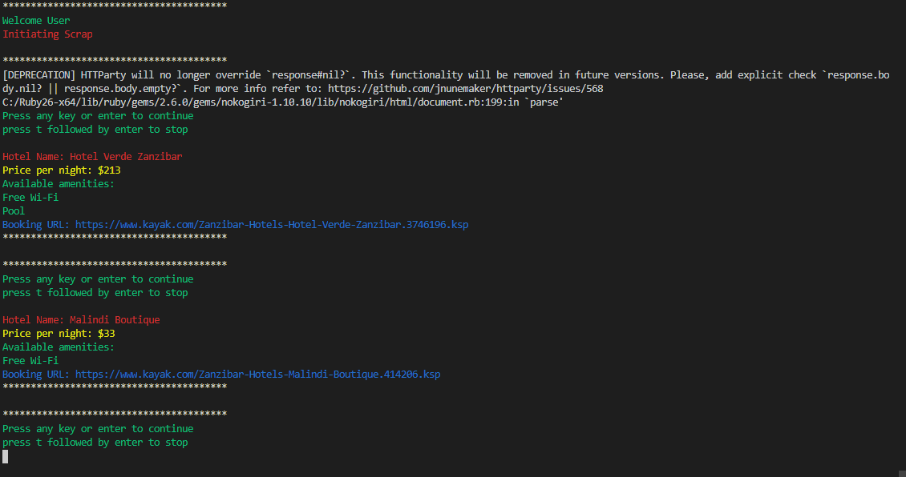

#  Web_Scraper
This is a web scraper built using Ruby. It is a Microverse capstone project that is part of the Ruby module in the Microverse curriculum. It is built to showcase ability to develop a fully working project based on Ruby & given business logic.

## Project Design:
> Project output screenshot.

This project is a Web Scraper that takes information from Kayak.com website. It scrapes through the top hotels in Zanzibar City in Tanzania and displays the results to the user. The scraper takes the information retrieved from the website & uses Nokogiri gem to store everything as an object. It then takes this object & retrieves information about the name, price per night, and the amenities available in the hotel and displays all these in a way that's more readable & organized.

## Built With

- Ruby
- Nokogiri
- HTTParty
- Colorize
- Rspec (testing)
- byebug (for debugging)

## SetUp
To start contributing to this project run:  
  `https://github.com/Nkuria/Ruby-Web_scrapper`  

Now create a feature branch & open a pull request based on development (develop) branch.

After cloning the project, cd into the (Ruby-web_scraper) directory where the code is stored & navigate into bin older using `cd bin` command on the terminal, then run: `bundle install` to install the necessary dependencies & lastly run: `ruby main.rb` to see the scraper in action.

## To Run Rspec:

Open your terminal & run `rspec` & the program will run tests for two files (main.rb & scrapper.rb).

## Tools Used:

- Visual Studio Code

## Author

👤 **Nick Kuria**

- Github: [@Nkuria](https://github.com/Nkuria)
- Linkedin: [Nick Kuria](https://www.linkedin.com/in/nick-kuria-a148931a9/)
- claytonsiby@gmail.com

# 🤝 Contributing

Contributions, issues and feature requests are welcome!

Feel free to check the [issues page](https://github.com/Nkuria/Ruby-Web_scrapper/issues).

## Please show your support

Give a ⭐️ if you like this project!

## Acknowledgments

- Microverse.org
- tutorialspoint.com
- StackOverflow

# 📝 License

This project is [MIT](https://github.com/Nkuria) licensed.